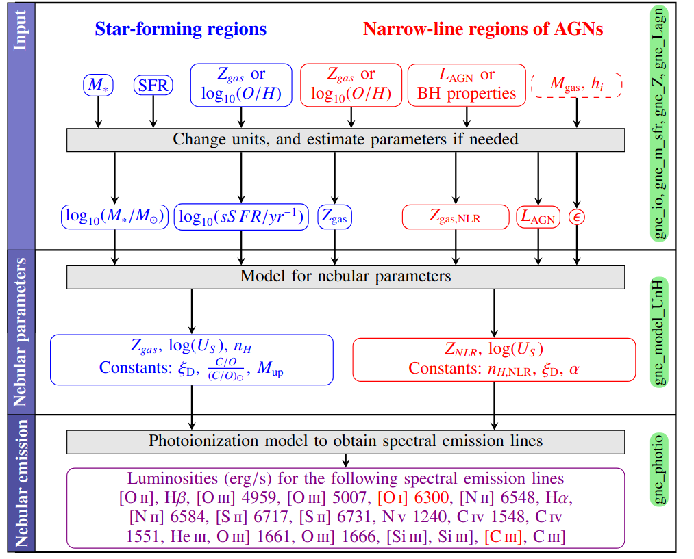

|docs| |tests| |coverage| 

.. inclusion-marker-do-not-remove

This code is in beta. Please report issues and be patient with the incomplete documentation.
   
Get nebular emission
======================

**get_nebular_emission** is a Python code to calculate the luminosities of spectal emission lines from global properties, from either a galaxy or a galaxy component. This code calculates emission line luminosities from both star forming HII regions and narrow-line regions (NLR) of AGNs. The input parameters are different for each calculation, as can be seen in the flowchart below. The calculation for star-formin gregions follows Baugh et al. 2022 (https://arxiv.org/abs/2112.00129) and it requires as input: the stellar mass, the star formation rate (SFR), and the cold gas metallicity. The calculation for NLR of AGNs requires as input the cold gas metallicity in the center, and the bolometric luminosity (or properties to derive this, such as the mass accretion rate). If the total mass of cold gas in the center and the effective radius of the galactic components are provided, the code can estimate the volume-filling factor, otherwise this is assumed to be a constant. 

The code expects text or HDF5 files with data of global galactic properties from one or more galaxies. These properties can correspond to any number of galaxy component (for example, disk and bulge), for which the code calculates emission lines independently. Finally, it outputs a HDF5 file with all the results. As long as the needed input parameters are available, the code can be coupled with model galaxies produced with different codes: hydrodynamical simulations, semi-analytical models, empirical ones, etc. 

First, the code connects global galactic properties to the ionising source, either HII regions or the NLR. Then, a photoionisation model is used to obtain the emission line luminosities given the characteristics of the ionising sources. This is done interpolating the values from predefined photoionisation grids. Each part of the procedure is handled by a different module, specified in the flowchart:

|flowchart|

Requirements and Installation
-----------------------------

This code has been developed in Python 3.7.1 and it is compatible with Python above 3.5 versions. The code has been tested to run in Linux and Windows operating systems. 

This code uses numpy and h5py as specified in docs/requirements.txt. Test plots are made with matplotlib.

To install this code, clone the GitHub repository (https://github.com/galform/get_nebular_emission):

``
git clone git@github.com:galform/get_nebular_emission.git
``

Install as a local package so it can be run from any directory:
``
pip install -e .
``

Running the code
-----------------------------
The code can be run following the **run_txtinput_tutorial.py** or **run_hdf5input_tutorial.py** as a normal python programs.  
``
python run_txtinput_tutorial.py
``

By default, output data and plots will be generated in a folder within this directory called *output*.

To run a batch of jobs using SLURM the following script can be used, which uses templates within the folder data/slurm_templates:
``
python slurm_hdf5_run.py
``

Folders
-----------------------------
**data** Contains the example data sets, the nebular tables used by the code and the observational data used in the test plots.

**docs** These documentation folder allow us to produce the readthedocs website.

**src** Contians the python programs to calculate spectral emission lines.

**tests** Automatic tests for functions in the package

Tutorial with an example run
-----------------------------

Example codes going through all the main options are available for an input text file, **run_txtinput_tutorial.py**, or hdf5, **run_hdf5input_tutorial.py**. The tutorials run over model galaxies stored in the *example_data* directory. These are produced at z = 0 by the semi-analytical model described in Gonzalez-Perez et al. 2020 (https://arxiv.org/abs/2001.06560).

The example code make selections within the data, calculate emission line luminosities and make test plots. A line ratio diagram with the results from the example text file, without considering dust attenuation, can be seen below together with the local data from Favole et al. 2023 (https://arxiv.org/abs/2303.11031).

|bpts|

Tests
-----
All the available tests on functions can be ran with:
``
pytest tests/ -v
``

Citing
-----------------------
If you use get_emission_lines, please cite the following paper:

* Baugh et al. 2022 (https://arxiv.org/abs/2112.00129)

	     
.. |docs| image:: https://readthedocs.org/projects/get-nebular-emission/badge/?version=latest
   :target: https://get-nebular-emission.readthedocs.io/en/latest/

.. |tests| image:: https://github.com/viogp/get_nebular_emission/workflows/Tests/badge.svg
   :target: https://github.com/viogp/get_nebular_emission/actions

	 
.. |coverage| image:: https://codecov.io/gh/viogp/get_nebular_emission/graph/badge.svg?token=BLZUS5BORI 
 :target: https://codecov.io/gh/viogp/get_nebular_emission
	 
.. |bpts| image:: data/example_data/iz61/bpts.pdf
		 

